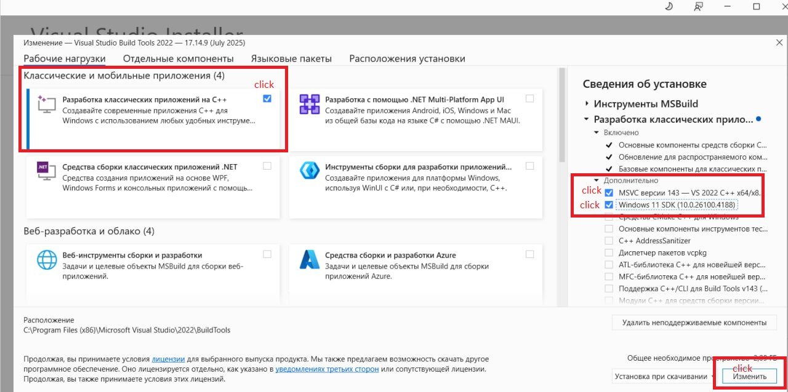

# Содержание
## Установка и настройка
### Установка LuaJIT
  - [Linux](#установка-luajit-linux)
  - [Windows](#установка-luajit-windows)
### Настройка окружения
  - [Language Server](#language-server)
  - [Пакетный менеджер](#package-manager)
### Установка LuaRocks
  - [Linux](#установка-luarocks-linux)
  - [Windows](#установка-luarocks-windows)
### Работа с пакетами
  - [Linux](#установка-пакетов-luarocks-linux)
  - [Windows](#установка-пакетов-luarocks-windows)
## Изучение Lua
- [Источники информации](#источники-информации)
- [Полезные репозитории](#полезные-репозитории)

--- 
# Установка LuaJIT (Linux) 

Репозиторий - [github.com/LuaJIT/LuaJIT](https://github.com/LuaJIT/LuaJIT)
Клонируем, делаем `sudo make install`, luajit установится в `/usr/local/bin` 

Установить в кастомную папку можно так

```
make install PREFIX=/home/myself/lj2
```

### Проверка установки

```
serr@home:~$ luajit -v
LuaJIT 2.1.1753364724 -- Copyright (C) 2005-2025 Mike Pall. https://luajit.org/
serr@home:~$
```

### Создание алиаса luajit -> lj (опционально)

В `~/.bashrc` добавить `alias lj="luajit"`

Теперь интерпретатор доступен через `luajit` и `lj`

# Установка LuaJIT (Windows)
### Предпосылки

Для того чтобы собрать luajit на Windows нужно иметь _Microsoft Build Tools_. 

Скачать установщик можно тут [aka.ms/vs/17/release/vs_buildtools.exe](https://aka.ms/vs/17/release/vs_buildtools.exe)

Далее минимальный список того что надо установить на скрине


### Установка

Репозиторий - [github.com/LuaJIT/LuaJIT](https://github.com/LuaJIT/LuaJIT)

Я его склонировал в `C:\tools\`

Нужно запустить _Visual Studio Developer Command Prompt_, перейти в нем в папку `src` и выполнить `msvcbuild`

```
**********************************************************************
** Visual Studio 2022 Developer Command Prompt v17.3.6
** Copyright (c) 2022 Microsoft Corporation
**********************************************************************

C:\Program Files\Microsoft Visual Studio\2022\Community>cd C:\tools\LuaJIT\src
C:\tools\LuaJIT\src>msvcbuild
```

Вывелось:

```
=== Successfully built LuaJIT for Windows/x64 ===
```

В папке `C:\tools\LuaJIT\src` появились файлы `lua51.dll`, `lua51.lib` и `luajit.exe`

Теперь переименовал `C:\tools\LuaJIT\` в `C:\tools\repo_luajit\`, создал новую папку `C:\tools\LuaJIT\`, туда скопировал `lua51.dll`, `lua51.lib` и `luajit.exe`, создал папку `C:\tools\LuaJIT\lua\jit\` и скопировал туда все `.lua` файлы из  `C:\tools\repo_luajit\src\jit`

Итоговая структура папки `C:\tools\LuaJIT\`:

```
├── luajit.exe
├── lua51.dll
├── lua51.lib
├── <- put your own classic Lua/C API modules (*.dll) here
└── lua
    ├── <- put your own Lua modules (*.lua) here
    └── jit
        ├── bc.lua
        └── (etc …)
```

### Проверка установки

```
C:\tools\LuaJIT>luajit -v
LuaJIT 2.1.1748459687 -- Copyright (C) 2005-2025 Mike Pall. https://luajit.org/
```

# Language Server

Я использую VS Code, расширение `Lua` от sumneko, в нем в параметре `lua.runtime.version` выбрал `LuaJIT`

# Package manager

Использую [LuaRocks](https://luarocks.org/)

### Установка LuaRocks (Linux)

Качаем последней версии `tar.gz` отсюда [luarocks.github.io/luarocks/releases](https://luarocks.github.io/luarocks/releases/)

Или можно склонировать репозиторий [github.com/luarocks/luarocks](https://github.com/luarocks/luarocks)

```
./configure --with-lua=/usr/local --with-lua-include=/usr/local/include/luajit-2.1
```

Вывод

```
serr@home:~/Рабочий стол/repos/luarocks (1-я копия)$ ./configure --with-lua=/usr/local --with-lua-include=/usr/local/include/luajit-2.1

Configuring LuaRocks version 3.12.2...

Lua version detected: 5.1
Lua interpreter found: /usr/local/bin/luajit
lua.h found: /usr/local/include/luajit-2.1/lua.h
unzip found in PATH: /usr/bin

Done configuring.

LuaRocks will be installed at......: /usr/local
LuaRocks will install rocks at.....: /usr/local
LuaRocks configuration directory...: /usr/local/etc/luarocks
Using Lua from.....................: /usr/local
Lua include directory..............: /usr/local/include/luajit-2.1

* Type make and make install:
  to install to /usr/local as usual.
* Type make bootstrap:
  to install LuaRocks into /usr/local as a rock.
```

Дальше просто 

```
sudo make && sudo make install
```

Проверка установки 

```
serr@home:~$ luarocks --version
/usr/local/bin/luarocks 3.12.2
LuaRocks main command-line interface
```

### Установка LuaRocks (Windows)

Также как и при установке LuaJIT, нужны _Microsoft Build Tools_ (см. раздел с установкой LuaJIT)

Репозиторий - [github.com/luarocks/luarocks](https://github.com/luarocks/luarocks)

Я его склонировал в `C:\tools\`, переименовал в `repo_luarocks`

```
C:\tools\repo_luarocks>install.bat /P C:\tools\luarocks /LUA C:\tools\LuaJIT\luajit.exe /MSVC
```

Установил следующей командой. Тут после /P указывается путь куда будет установлен luarocks (папку создаст сам), после /LUA указывается папка с интерпретатором Lua (в моем случае luajit.exe), после /INC указывается путь к заголовочным файлам Lua (_предварительно я в C:\tools\LuaJIT\ склонировал репозиторий LuaJIT (переименовал в repo_luajit) и там в папке src есть эти заголовочные файлы_)

```
C:\tools\repo_luarocks>install.bat /P C:\tools\luarocks /LUA C:\tools\LuaJIT /INC C:\tools\LuaJIT\repo_luajit\src /MSVC
```

Вывелось

```
============================
== Installing LuaRocks... ==
============================


Installing LuaRocks in C:\tools\luarocks...
Created LuaRocks command: C:\tools\luarocks\luarocks.bat
Created LuaRocks command: C:\tools\luarocks\luarocks-admin.bat

Configuring LuaRocks...
Created LuaRocks hardcoded settings file: C:\tools\luarocks\lua\luarocks\core\hardcoded.lua
Created LuaRocks config file: C:\tools\luarocks\config-5.1.lua

Creating rocktrees...
Created system rocktree    : "C:\tools\LuaJIT\systree"
Local user rocktree exists : "C:\Users\user\AppData\Roaming\LuaRocks"

Loading registry information for ".rockspec" files

============================
== LuaRocks is installed! ==
============================


You may want to add the following elements to your paths;
Lua interpreter;
  PATH     :   C:\tools\LuaJIT
  PATHEXT  :   .LUA
LuaRocks;
  PATH     :   C:\tools\luarocks
  LUA_PATH :   C:\tools\luarocks\lua\?.lua;C:\tools\luarocks\lua\?\init.lua
Local user rocktree (Note: %APPDATA% is user dependent);
  PATH     :   %APPDATA%\LuaRocks\bin
  LUA_PATH :   %APPDATA%\LuaRocks\share\lua\5.1\?.lua;%APPDATA%\LuaRocks\share\lua\5.1\?\init.lua
  LUA_CPATH:   %APPDATA%\LuaRocks\lib\lua\5.1\?.dll
System rocktree
  PATH     :   C:\tools\LuaJIT\systree\bin
  LUA_PATH :   C:\tools\LuaJIT\systree\share\lua\5.1\?.lua;C:\tools\LuaJIT\systree\share\lua\5.1\?\init.lua
  LUA_CPATH:   C:\tools\LuaJIT\systree\lib\lua\5.1\?.dll

Note that the %APPDATA% element in the paths above is user specific and it MUST be replaced by its actual value.
For the current user that value is: C:\Users\user\AppData\Roaming.
```

Проверить установку можно так

```
luarocks --version
```

# Установка пакетов LuaRocks (Linux)

Я предпочитаю не засорять компьютер и для каждого проекта устанавливать нужные ему зависимости в директорию с ним

```
luarocks install --tree ./lua_modules luasocket
```

В директории `recipes` в этом репозитории находится скрипт `sp.lua`, он добавляет папку `./lua_modules` в пути в которых интерпретатор ищет модули. Для запуска скрипта, который зависит от `luasocket` надо использовать команду `luajit sp.lua <имя целевого скрипта>`

### Далее опционально

Лично я закинул `sp.lua` в папку к интерпретатору

```
serr@home:/usr/local/bin$ ls luajit sp.lua
luajit  sp.lua
```

и добавил алиас в `~/.bashrc`

```
alias ljsp="luajit /usr/local/bin/sp.lua"
```

Теперь для запуска скрипта, который зависит от `luasocket` просто использую `ljsp <имя целевого скрипта>`

Также сделал алиас для установки зависимости

```
alias lrit="luarocks install --tree ./lua_modules"
```

Теперь если мне например нужно в `script.lua` использовать функции из `luasocket` я делаю в папке с `script.lua` так

```
lrit luasocket
ljsp script.lua
```

# Установка пакетов LuaRocks (Windows)

Я предпочитаю не засорять компьютер и для каждого проекта устанавливать нужные ему зависимости в директорию с ним

Консолью необходимо использовать _Visual Studio Developer Command Prompt_, т.к. там есть доступ к компилятору которым собраны `LuaJIT` и `LuaRocks`, этот же компилятор будет собирать библиотеки пакетов

Предположим я сейчас нахожусь в

```
C:\Users\user\Desktop\luajit-playgrounds\src\luarocks\proj_example>
```

Установка, например, luasocket в директорию `lua_modules` в текущем проекте выглядит следующим образом (директория `lua_modules` при этом автоматически создастся если ее нет)

```
luarocks install --tree ./lua_modules luasocket
```

В директории `recipes` в этом репозитории находится скрипт `sp.lua`, он добавляет папку `./lua_modules` в пути в которых интерпретатор ищет модули. Для запуска скрипта, который зависит от `luasocket` надо использовать команду `luajit sp.lua <имя целевого скрипта>`

# Источники информации

- Роберту Иерузалимски - "Программирование на языке Lua"
- Офф. сайт LuaJIT - [luajit.org](https://luajit.org/)
- Lua 5.1 Reference Manual - [www.lua.org/manual/5.1/](https://www.lua.org/manual/5.1/)
- Lua 5.1 Reference Manual на русском - [linuxshare.ru/docs/devel/languages/lua/reference/index.html](https://linuxshare.ru/docs/devel/languages/lua/reference/index.html)
- Документация пакета `luv` (libuv биндинги для lua) - [github.com/luvit/luv/blob/master/docs/docs.md](https://github.com/luvit/luv/blob/master/docs/docs.md)

# Полезные репозитории
- LuaJIT - [github.com/LuaJIT/LuaJIT](https://github.com/LuaJIT/LuaJIT)
- LuaRocks - [github.com/luarocks/luarocks](https://github.com/luarocks/luarocks)